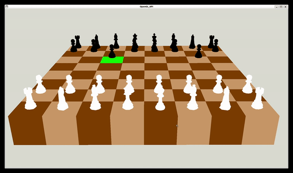

  

<h1 align="center">Hi 👋, I'm Hamza</h1>

<h3 align="center">Passionate about Software Engineering, Artificial Intelligence, and Geomatics 🌍</h3>

  

---

### 🧑‍💻 About Me:
- 🎓 Preparing for a second MEng Degree in Information systems and data engineering at ENSG engineering school
- 💼 Had my first 5years degree as a (geo) data engineer.
- 🌱 Continuous learning of **Backend Development and Artificial Intelligence**.
- 🔭 Focused on projects related to **Data and AI using Python and SQL, Server and Client with Nodejs, Web Development, Devops, BI Dashboard tools, AI Agents etc.**
- ❤️ I enjoy coding, exploring new technologies, and solving complex problems.

### ⚡ Technical Skills:

  
  
  
  
  
  
  
  

---

### 🚀 Iconic Projects I've Worked On:

#### 1- **☀️IRESEN | Developed a Web Application to Monitor Huge Solar Farms by Deploying a Deep Learning Model for Computer Vision along with Web Mapping and Data Visualisation**
[📽 Demo on LinkedIn](https://www.linkedin.com/posts/hamza-rachidi-igt_data-energy-datavisualization-activity-7015311398507266048-M7gP?utm_source=share&utm_medium=member_desktop)
- **Objective**: Development of a Web Application to monitor large photovoltaic farms using a client-server architecture and a deep learning model to detect thermal defects.
- **Key Features**:
  - **Site Prospection**: Evaluated optimal sites for new photovoltaic plants using web mapping.
  - **Data Visualization**: Statistical analysis and visualization of data stored in a PostgreSQL database, accessible to park managers via DBeaver.
  - **Thermal Fault Detection**: Automatic detection and classification of invisible thermal defects in photovoltaic modules using a CNN-based deep learning model with ortho-rectified thermal imagery captured by drone cameras.
  - **Interactive Mapping**: Geolocalized thermal defects on an interactive map to optimize both time and cost required for maintenance.
- **Technologies Used**:
  - **Backend**: Python (Numpy, Pandas, GeoPandas, Matplotlib, Keras, TensorFlow, Flask, GDAL, Shap, SQLAlchemy, Folium).
  - **Frontend**: HTML5, CSS, JavaScript.
  - **Database**: PostgreSQL.

#### 2-**📊 BI Analytics Dashboard | Deep Analysis of Underemployment in Morocco between (2017–2023)**  
[📽 Demo on LinkedIn](https://www.linkedin.com/posts/hamza-rachidi-igt_businessintelligence-dataanalytics-sousemploi-activity-7326577783726366720-htWO?utm_source=share&utm_medium=member_desktop&rcm=ACoAACy7E28Bset3BG8lQHmaZPAmhGzw3YnLvFw)
- **Objective**: Development of an interactive dashboard to analyze the spatial and demographic distribution of underemployment (situations where workers are employed in roles below their capacity—either in time or in quality) in Morocco from 2017 to 2023. The project contributes to territorial Business Intelligence in support of the Sustainable Development Goal No 8 – Decent Work and Economic Growth.
- **Key Features**:
  - **Dynamic Filtering** of key indicators by region(s), the year, gender, area of residence (urban/rural), underemployment rate range.
  - **Analytical Graphs** comparing regional trends by sex and underemployment rate range.
  - **Spatial Exploration** through choropleth maps, proportional symbols with contextual legends.
- **Technologies Used**:
  - **🧠 Data Engineering**: Python, Geo Pandas, R, Jupyter Notebook
  - OCR to extract data from image reports
  - **📊 BI & Visualization**: ArcGIS Dashboards
  - **🖌️ UX Design**: Figma
 
### 3‑**🤖 AI-Powered Web Application to share user experiences and interact with its realted metadata using Natural‑Language | AI, Devops and Backend Web Developer in a team**  

**Objective:**  
My part of responsability is to design and deploy an AI agent which empowers registered users to **store**, **query**, **comment** and **auto-complete** metadata of published user experiences that are stored in a Neo4j graph database all by using **human‑language input**. I also dockerised the web application to be portable, and implemented as well the backend structure of the React web application so as to connect with Neo4J and the front UX interface.  

**Key Features:**  
  - Create functions to store nodes & relationships efficiently via human conversational input.
  - Natural‑language query → Action : Metadata Creation and Storage, Search & Auto-completion.
  - REST routing in **Express.js** handling AI‑agent integration and Neo4j access via users requests.   
  - Fully **Dockerized** architecture: separate containers.
  - Build the LLM front end chatbot window with the React.js framework and The UX design in Figma 

**Technologies Used:**  
  - **Backend**: Node.js + Express.js & Neo4j Driver  
  - **Data Engineering and AI**: Neo4j graph databases & Cypher & AI prompt engineering and Tool Calling with OpenAI API (gpt‑3.5‑turbo)
  - **UX Design**: Figma 
  - **Deployment**: Docker Compose
 
#### 4- **CI/CD DevOps | Continuous Deployment and Continuous Integration for a Vehicle Management CLI after coding the client side | Collabaration with another developer**
- **Objective**: Development of a CI/CD pipeline to automate the build, lint, testing, and deployment of a CLI application designed to interact with a vehicle management server. The project integrates continuous integration, containerization with Docker, and automated deployment to ensure software reliability and maintainability.
- **Key Features**:
  - Developed a command line interface using Commander JavaScript framework that serves as a HTTP client for the server developed with Nodejs.   
  - Fully Automated CI/CD Pipeline: Implemented GitHub Actions to streamline linting, unit testing with Jest, TypeScript compilation, and Docker image publishing.
  - Containerized CLI Application: Packaged the CLI using Docker file to ensure portability and reproducibility across different environments.
  - Continuous Deployment Workflow: Automated image build and push to Docker Hub on Git tag releases, synchronizing GitHub repository history with Docker image versions.
  - Robust Error Handling & Unit Testing: Validated the CLI commands (vehicle creation, listing, and deletion) through comprehensive Jest test cases and mocking techniques.
- **Technologies Used**:
  - **CI/CD & Deployment**: GitHub Actions, Docker, Docker Hub
  - **Programming & Testing**: TypeScript ( Commander ) , Jest, ESLint

#### 5- **♟️3D Chess**

- **Description**: A 3D chess game simulation where pieces move according to chess rules.
- **Key Features**:
  - Fully modeled 3D chessboard with interactive piece movements.
  - Chess rules implemented for piece movements and captures.
  - Visual indicators for valid moves and captured pieces.
  - Camera controls to adjust and view the board interactively.
- **Technologies Used**:
  - Programming Language: **C++**
  - Build Tool: **CMake**

#### 6- **🗺️ Mini-GIS Project | Backend Developer in a classteam**  
[Youtube Video Here](https://www.youtube.com/watch?v=YYriKDjRbh0)
- **Description**: A full-featured, user-friendly, free, and open-source Geographical Information System (GIS) designed for Unix platforms.  
- **Key Features**:  
  - **2D Mode**:  
    - Load and visualize geospatial data locally in formats like **.shp**, **.geojson**, and **.tiff**.  
    - Load Stream data from WMS (Web Map Service) and WFS (Web Feature Service).  
    - Manage layers (reordering, renaming, deleting) and focus on specific ones.  
    - Display entity information interactively in an attribute table.  
  - **Session Management**: Save and restore layers to maintain the application's last state.  
- **Technologies  Used**:  
  - Programming Language: **C++**
  - Frontend Interface: **Qt**
  - API: **GDAL**
  - Build Tool: **CMake**
  - Agile Methodology : **Scrum**

#### 7- **🌍A QGIS Plugin | A Small Class project for Geographic Data Analysis**  
- **Description**: Development of a QGIS plugin that enables users to extract, analyze, and visualize relative information around a selected point. The tool integrates coordinate transformation, reverse geocoding, spatial analysis, and buffers visualization.  

- **Key Features**:   
  - Point Layer Selection: Allows users to choose from available point layers in their QGIS project.  
  - Geographic Coordinate Display: Captures clicked points and displays their coordinates in WGS 84 (EPSG:4326).  
  - Reverse Geocoding: Retrieves the nearest address, including street name, house number, INSEE code, and city name.  
  - Buffer Zone Calculation Visualization: Generates a buffer around the selected point with a user-defined radius to compute the number of vector layer features within the buffer zone.  
  
- **Technologies  Used**: 
  - Backend & Data Processing: **Python (Requests, PyQGIS)**.  
  - API : **GéoPlateforme for reverse geocoding**, QGIS Python API.  
  - Frontend: **Qt Designer, PyQt**.  

---

⭐ Feel free to give a ⭐ to my repositories if you find them interesting!

